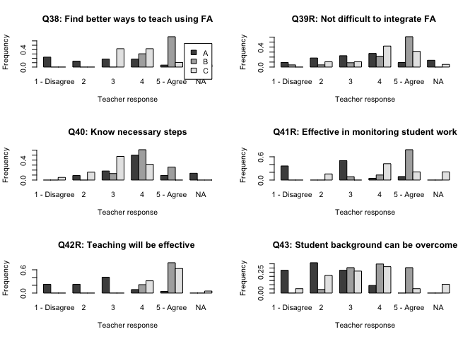

Similarity network analyses of self-efficacy attributes
================
Jesper Bruun
3/12/2020

## Loading libraries and functions

``` r
library(igraph)
```

    ## 
    ## Attaching package: 'igraph'

    ## The following objects are masked from 'package:stats':
    ## 
    ##     decompose, spectrum

    ## The following object is masked from 'package:base':
    ## 
    ##     union

``` r
library(PMCMRplus)
library(pgirmess)
library(effsize)
#library(rcompanion)
library(gplots)
```

    ## 
    ## Attaching package: 'gplots'

    ## The following object is masked from 'package:stats':
    ## 
    ##     lowess

``` r
source("R_scripts/backboneExtraction.r")
source("R_scripts/segregation.r")
```

## Load data and have a looksie

    ##    ID          Name pre38 pre39 pre40 pre41 pre42 pre43 pre44 pre45 pre46 pre47
    ## 1   1  Respondent 1     4     4     3     3     3    NA    NA     3     3     3
    ## 2   2  Respondent 2     4     4     3     4     5     4    NA     2     4     5
    ## 3   3  Respondent 3     4     3     4     3     3     2     4     4     4     4
    ## 4   4  Respondent 4     4    NA     1     2    NA     4     2     1    NA     5
    ## 5   5  Respondent 5     4     2     3     4     4     4     5     3     4     3
    ## 6   6  Respondent 6     3     5     4     3     3     2    NA     2     3    NA
    ## 7   7  Respondent 7     4     5     4     3     2     3     3     4     3     3
    ## 8   8  Respondent 8     3     1     2     2     2    NA    NA     2    NA     1
    ## 9   9  Respondent 9     5     5     5     5     2     4     2     5     2     3
    ## 10 10 Respondent 10     5     5    NA     5     5     5     5     4    NA     3
    ## 11 11 Respondent 11     4     5     1     4     3     3     2     3    NA     3
    ## 12 12 Respondent 12     5     5     3    NA     3     3     3     4     4     3
    ## 13 13 Respondent 13     4     5     3     4     4    NA    NA     3     4     5
    ## 14 14 Respondent 14     5     3     3     5     5     1     1     3    NA     3
    ## 15 15 Respondent 15     5     5     3     4     4     2     4     3     5     4
    ## 16 16 Respondent 16     3     4     4     3    NA    NA     5     3    NA     4
    ## 17 17 Respondent 17     1     4     3     1     3     2     2     2    NA    NA
    ## 18 18 Respondent 18    NA    NA     2     3     2     1     3     2     5    NA
    ## 19 19 Respondent 19     1     4     3     1     3     3     2     2     4     2
    ## 20 20 Respondent 20     2     5     3     1     2     3     2     4     5     1
    ## 21 21 Respondent 21     1     2     5     1     1     1     5     4     4     4
    ## 22 22 Respondent 22     4     1     5     1     1     2     3     2     5     1
    ## 23 23 Respondent 23     2     2     4     3     3     4     4     3     3     2
    ## 24 24 Respondent 24     1     4     4     1    NA     1    NA     1     5     3
    ## 25 25 Respondent 25     1    NA    NA     1     2     1    NA     1     5     2
    ## 26 26 Respondent 26     1    NA    NA     1     5     1     3     4     5    NA
    ## 27 27 Respondent 27     1     3     4     3     1     3     4     1     5     3
    ## 28 28 Respondent 28     1    NA    NA     3     2     4    NA    NA     5     3
    ## 29 29 Respondent 29     1    NA    NA     1     4     4     2    NA     2    NA
    ## 30 30 Respondent 30    NA    NA    NA     3     2     3     3    NA    NA     4
    ## 31 31 Respondent 31    NA     5     1     1     5     5     1     3    NA    NA
    ## 32 32 Respondent 32     1    NA     1     3     4     4     1    NA    NA    NA
    ## 33 33 Respondent 33    NA    NA    NA    NA    NA    NA    NA    NA    NA    NA
    ## 34 34 Respondent 34     2     1    NA     3     2     4     5     4     4     2
    ## 35 35 Respondent 35    NA    NA    NA     1     3     2     4    NA    NA     2
    ## 36 36 Respondent 36     1     5    NA     1    NA     2     4     3     3     2
    ## 37 37 Respondent 37     1     5     3     1     3     3    NA    NA    NA     2
    ## 38 38 Respondent 38     1     5    NA     3     2     2     4     1     5     1
    ## 39 39 Respondent 39     4     2     4     3     4     4     3     3     5    NA
    ## 40 40 Respondent 40     4     3     3    NA     2     2     2     3     4     2
    ## 41 41 Respondent 41     1     4     2     1     5    NA     1    NA    NA     4
    ## 42 42 Respondent 42     1     2     5     3     4     4    NA    NA    NA    NA
    ## 43 43 Respondent 43    NA     3     2    NA    NA     5     3     2     3    NA
    ## 44 44 Respondent 44     5     2     3     3    NA     2     2     3    NA     3
    ## 45 45 Respondent 45     5     2     2     3     3     2     3     2     2     3
    ## 46 46 Respondent 46     4     5     4     5     5     2     2     2     2    NA
    ## 47 47 Respondent 47     4     2     4     3     3     3     3     3     3     3
    ## 48 48 Respondent 48     5     2     3     4     4     2     4     4     2     4
    ## 49 49 Respondent 49     5     5     5     5     5     4     4     5     2     5
    ## 50 50 Respondent 50     2     4     4     2     3     3     1     2     3     2
    ## 51 51 Respondent 51     4     2     4     2     1     4    NA     2    NA     1
    ## 52 52 Respondent 52    NA    NA     3     2     1     3     3     3     3     3
    ## 53 53 Respondent 53     5     5    NA     5     1    NA     5    NA     4    NA
    ## 54 54 Respondent 54    NA     1     1     1     1    NA     2     1    NA     2
    ## 55 55 Respondent 55    NA    NA     1     1     1     4    NA    NA    NA     1
    ## 56 56 Respondent 56     5     3     3     1     1     5     5     4     1     1
    ## 57 57 Respondent 57     3     1    NA     4     1     1     2     3     2     1
    ## 58 58 Respondent 58     4     2    NA     2     2    NA    NA     3    NA     2
    ## 59 59 Respondent 59     5     1    NA     1     1     3     4    NA     1    NA
    ## 60 60 Respondent 60     5     1     4     3     2     4     2     3     1     1
    ## 61 61 Respondent 61     3     2     4     4     3     3     2     2     4     2
    ## 62 62 Respondent 62     5     1    NA     1     1     5     5    NA     1     1
    ## 63 63 Respondent 63    NA    NA    NA    NA    NA    NA    NA    NA    NA    NA
    ## 64 64 Respondent 64     4     2     2     2     2    NA     3    NA     4     2
    ## 65 65 Respondent 65     4     1     2     1     1     1     4     2     1     1
    ## 66 66 Respondent 66     4     1     4     1     1     4     4     4     1     4
    ## 67 67 Respondent 67     5    NA     3     3    NA     3     3    NA     4     4
    ## 68 68 Respondent 68     4     3     4     1     1     3     4     4     2     2
    ## 69 69 Respondent 69     3     2    NA    NA     3     3     4    NA    NA    NA
    ## 70 70 Respondent 70     5     3     4    NA     1    NA     1    NA     2    NA
    ## 71 71 Respondent 71     5     3    NA     3     5    NA     2     2    NA    NA
    ## 72 72 Respondent 72     5     5     3     2     4     5     5     4     4    NA
    ## 73 73 Respondent 73     5     5     3     2     5     2     2     5     5     5
    ## 74 74 Respondent 74     5     4     4     4     4     3     3     4     2     3
    ## 75 75 Respondent 75     5     5     4     5     5     3     5     4     5     5
    ## 76 76 Respondent 76     3     4     1     1    NA    NA    NA     2    NA     3
    ## 77 77 Respondent 77     5     4     1     4     5     5    NA     2    NA     4
    ## 78 78 Respondent 78     3     5     2     2     5     2     2     2     5     3
    ## 79 79 Respondent 79     4     4    NA    NA     4     4    NA     3     4     5
    ## 80 80 Respondent 80     3     2     4     5     5     4     4     4     5     5
    ## 81 81 Respondent 81     5     5     2     5     5     2    NA     5     2     5
    ## 82 82 Respondent 82     4     4     2     2     4     5     5     3     4     2
    ## 83 83 Respondent 83     4     4     3     4     5     3     4     2     3    NA
    ## 84 84 Respondent 84     4     5     4     5     5     4     4     4     5     5
    ## 85 85 Respondent 85     3     5     5     5     5     1     3     4     4     2
    ## 86 86 Respondent 86     4     5     4     5     5     4    NA     4     5     5
    ## 87 87 Respondent 87     4     5     3     5     5     3     4     4     5     4
    ## 88 88 Respondent 88    NA     5     5     5     5     3     3     5     5     5
    ## 89 89 Respondent 89     4     4     2     3     4     4     3     4    NA     4
    ## 90 90 Respondent 90     4     4     4     5     5     5     4     4     5     4
    ## 91 91 Respondent 91     5     5     3     5     5    NA     3     3     1     5
    ## 92 92 Respondent 92     5     5     5     5     4     5     4     5     4     4
    ## 93 93 Respondent 93     3     5     3     5     4     4     3     3     4     2
    ##    pre48 pre49 post38 post39 post40 post41 post42 post43 post44 post45 post46
    ## 1      3     3      4      4      3      3      3      3      4      3      3
    ## 2      3     2      5      4      4      4      5      5      4      4      4
    ## 3      5     4      4      4      3     NA      4     NA      3      4      4
    ## 4      4     2      3      4      3     NA      4      1     NA      2      3
    ## 5      4     3      4      1      4      3      4      3      4      4      4
    ## 6      4     4      4      5      3     NA      5      3      3      3     NA
    ## 7      3     4      3      2      4      2      5      4      2      4      4
    ## 8     NA     1      3      3      2      4     NA      2      1      2      2
    ## 9      5     5      5      5      4      4      4      3      4      5      4
    ## 10    NA    NA      5      5      4      5      5      4      4      5     NA
    ## 11     3     4      5      5      5      5      5      3      5      5     NA
    ## 12     5     4      4      5      4      2      5      3      2      4      2
    ## 13    NA     2      5      4      4      5      5      4      4      4      4
    ## 14     3     3      5      4      3      3      3      1      1      3      3
    ## 15    NA     3      5      5      3      4      5      2      4      3      3
    ## 16     5     4      4      4      2      4     NA     NA     NA     NA     NA
    ## 17     3     4     NA      4      4      1      2      1      4      2      4
    ## 18    NA     3      2      2      4      3      1      2      5      3      3
    ## 19     2     5      2      4      3      3      4      4      5      5      5
    ## 20     1     3      1      5      4      3      2      1      4      1      5
    ## 21     2     1      3      1      5      3      1      1      5      4      4
    ## 22    NA     3      4      1      5      3      1      1      4      1      5
    ## 23     3     2      1      4      2      3      3      2      3      1      5
    ## 24    NA    NA      1      5      4      1      2      1     NA     NA      3
    ## 25     2    NA     NA     NA     NA      1      3      1      4      1      5
    ## 26    NA     5      1     NA     NA      1      3      2      4      3      1
    ## 27     2     2      3      2      4      1      1      2      5      2      5
    ## 28     4     2     NA     NA     NA      1      2      2      5     NA      5
    ## 29    NA     5      1      4      2      1      2      3      4      2      3
    ## 30     2     3      2      3      4      1      1      2      3      4      5
    ## 31    NA    NA     NA     NA     NA     NA     NA      5     NA     NA      1
    ## 32    NA     5     NA     NA     NA      3     NA     NA      1     NA     NA
    ## 33    NA    NA      1      4      2      3      4      4      1     NA      2
    ## 34     4     3      2      2      4      1      2      2      4      3      3
    ## 35     2     2     NA     NA     NA      1      2      2      4      4      5
    ## 36    NA     2      3      2      5      3      1      1      5      1      4
    ## 37    NA    NA      1      5      1      1      3      2     NA     NA     NA
    ## 38     2     1      3      2      4      1      3      5      4      2      2
    ## 39     3     3      3      4      4      3      3      2      3      4      3
    ## 40    NA     4     NA     NA     NA     NA     NA     NA     NA     NA     NA
    ## 41     2     5      1      3      4      1      4      3      2     NA      2
    ## 42     2     4      1      3      4      3     NA      3      2      4     NA
    ## 43    NA     2      4      2      4      4      4      4     NA      3      1
    ## 44     1     2      5      3      4      5      5      3     NA      4     NA
    ## 45     4     2      5      2      3      5      3      3      2      2      2
    ## 46    NA     4      5      3      3      5      5      5      4      3     NA
    ## 47     3     3      4      2      4      3      3      2      3      4      2
    ## 48     5     3      4      4      4      4      4      3      3      4      2
    ## 49     5     5      5      5      5      5      5      5      4      5      2
    ## 50     5     5      3      2      4      2      2      4      1      5      2
    ## 51     3     4     NA      3      4      3      3      3      4      4      1
    ## 52     3     3      3      3      3      3      3      3      3      3      3
    ## 53     5    NA      3     NA      3      4      5      4      4     NA      5
    ## 54     4     5      3      4      3      5      4      4     NA     NA      2
    ## 55    NA     3      3      4      3      4      5      4      1     NA     NA
    ## 56     5     4      3      3      4      4      3      4      3      2      3
    ## 57     4     4      5      4      3      5      5      3     NA     NA      5
    ## 58     4    NA      4      4      4      3      4      2      3      3      3
    ## 59     5     5      5      5      3      5      5      5      2     NA      5
    ## 60     4     2     NA      3      4      5      5      3      1      3      3
    ## 61     2     4      3      3      2      3      3      3      3      3      3
    ## 62     5     5      3      5      3      5      5      5      5      3      5
    ## 63    NA     5     NA     NA     NA      5     NA     NA     NA     NA     NA
    ## 64     4     4      3     NA      2      4      4     NA      3      2      4
    ## 65     3     3      3      2      1      2      5     NA      4      1      3
    ## 66     5     4      4      4      3      4      5      2      3      2      4
    ## 67     4     5      4     NA      3      4      4      4      4     NA      2
    ## 68     4     5      4      4      4      4      4      1      1      4      4
    ## 69     3    NA      4      3      3      3      4      4      4      3      4
    ## 70    NA     4      4     NA      3      4      4     NA      2     NA     NA
    ## 71     1     4      3      4      2     NA      5      2      5      3     NA
    ## 72     5     5      5      5      4      3      4      3      5      4     NA
    ## 73     3     5      4      4      4      5      5      3      5      4      5
    ## 74     4     3      5      5      4      2      5      3      4      4      2
    ## 75     5     5      5      5      4      5      5      4      3      4      5
    ## 76    NA     3      4      2      5      5      5      4      3      4      4
    ## 77     3     2      3      5      1      5      5      3     NA      2     NA
    ## 78     5     3      5      5      4      5      5      2     NA      4      5
    ## 79    NA     2      4      4      3      4      5      4      2      4      4
    ## 80     4     5      5      5      5      5      5      4      5      5      5
    ## 81    NA     5      4      3      2      5      5     NA      1      2     NA
    ## 82     4     1      4      4      3      5      5      5      5      4      4
    ## 83    NA     3     NA      5      3      4      5      2      4      3     NA
    ## 84     4     5      5      5      4      5      5      5      5      5      5
    ## 85     3     5      4      4      4      4      4      2      4      4     NA
    ## 86     4     4      4      5      4      5      5      5      4      4      5
    ## 87     4     5      3      4      2      4      4      4      2      3      4
    ## 88     5     5      3      4      2      5      5      3      3      4     NA
    ## 89     3     3      3      4      2      3      4      4      2      3      4
    ## 90     5     2      4      5      4      4      4      5      4      4      4
    ## 91     5     5      5      5      5      5      4      4      2      5      3
    ## 92     5     5      4      5      5      5      5      4      3      5      4
    ## 93     5     5      5      5      4      5      5      4      3      4      5
    ##    post47 post48 post49 control gender yearsTeaching country Physics Chemistry
    ## 1       3      3      2       n      1             3      DK       1         1
    ## 2       4      4      3       n      2             4      DK       1         1
    ## 3       5      5      4       n      1             2      DK       0         0
    ## 4       5      3      3       n      1             3      DK       1         0
    ## 5       4      4      3       n      1             3      DK       1         1
    ## 6       5      4      3       n      2             3      DK       1         0
    ## 7       5      5      4       n      1             3      DK       0         0
    ## 8       2      3      3       n      2             1      DK       0         0
    ## 9       5      4      5       n      1             4      DK       0         0
    ## 10      5      4      5       n      2             4      DK       1         1
    ## 11      4      4      5       n      2             2      DK       0         0
    ## 12      4      4      4       n      2             2      DK       0         1
    ## 13      5      4      5       n      1             2      DK       0         0
    ## 14      3      3      4       y      1             2      DK       0         0
    ## 15      5     NA      5       y      2             4      DK       0         1
    ## 16      5      4      2       y      1             4      DK       1         0
    ## 17      4      2      2       n      1             4      CH       1         0
    ## 18     NA      2      3       n      2             2      CH       0         0
    ## 19      2      2      3       n     NA             1      CH       0         0
    ## 20      2      2      2       n      2             4      CH       0         0
    ## 21      3      3      2       n      2             3      CH       0         0
    ## 22     NA     NA      1       n      2             3      CH       0         0
    ## 23      3      3      2       n      1             4      CH       0         0
    ## 24      5      1     NA       n      2             3      CH       0         0
    ## 25     NA      1      3       n      1             2      CH       1         0
    ## 26      5      1      2       n     NA             2      CH       1         0
    ## 27      4      1      2       n      1             4      CH       0         0
    ## 28     NA     NA      2       n      1             3      CH       0         0
    ## 29      3      3      2       n      2             1      CH       0         1
    ## 30     NA      2      2       n      1             2      CH       0         1
    ## 31     NA     NA      5       y      1             2      CH       0         1
    ## 32     NA      1      5       y      2             2      CH       0         0
    ## 33      4      2      5       y      1             2      CH       0         0
    ## 34      3      3      2       y      2             2      CH       0         0
    ## 35      2     NA      2       y      2             1      CH       1         0
    ## 36      3      2      1       y      1             3      CH       0         0
    ## 37     NA     NA     NA       y      1             4      CH       1         0
    ## 38      2      2      1       y      2             4      CH       0         0
    ## 39     NA      3      3       y     NA             2      CH       0         0
    ## 40     NA     NA     NA       y      2             3      CH       1         1
    ## 41      3      2      4       y      1             3      CH       0         1
    ## 42     NA      2      4       y      2             1      CH       0         0
    ## 43      5      4      4       n      2             3      FI       1         0
    ## 44     NA      4      5       n      2             3      FI       0         0
    ## 45      3      4      2       n      1             3      FI       0         0
    ## 46      5      4      4       n      2             4      FI       0         0
    ## 47      3      4      3       n     NA             3      FI       1         1
    ## 48      4      4      4       n     NA             3      FI       0         0
    ## 49      5      5      5       n     NA             3      FI       0         0
    ## 50      2      5     NA       y      1             4      FI       0         0
    ## 51      5      4      2       n      2             4      CZ       0         0
    ## 52      3      3      3       n      2             4      CZ       0         0
    ## 53      5      5      1       n      2             1      CZ       0         0
    ## 54      2      5      1       n     NA             4      CZ       0         0
    ## 55      5     NA      4       n      2             2      CZ       0         0
    ## 56      4      5      2       n      2             1      CZ       0         0
    ## 57      5      4      2       n     NA             4      CZ       0         0
    ## 58      2      4      3       n      2             2      CZ       0         1
    ## 59      5      5      1       n      2             1      CZ       0         0
    ## 60      4      4      2       n      1             3      CZ       0         0
    ## 61      3      3      3       y      1             3      CZ       0         1
    ## 62      5      4      1       y      2             1      CZ       0         0
    ## 63      5      5      1       y      2             4      CZ       0         0
    ## 64     NA      4      2       y     NA             4      CZ       0         0
    ## 65      5      2     NA       y      2             4      CZ       0         0
    ## 66      3      4      3       y      2             4      CZ       0         0
    ## 67      2      4      2       y      2             4      CZ       0         0
    ## 68      4      4      2       y      2             4      CZ       0         0
    ## 69      4      5      3       y      2             4      CZ       0         0
    ## 70      4      4      2       y      2             1      CZ       1         1
    ## 71      2      1      3       n      2             3       F       1         1
    ## 72      4      5      5       n     NA             3       F       1         1
    ## 73      4      2      2       n     NA             3       F       1         1
    ## 74      3      4      4       n     NA             3       F       1         1
    ## 75      5      5      3       n     NA             2       F       0         0
    ## 76      2      3      4       n     NA             4       F       0         0
    ## 77      5      4      3       n      2             2       F       0         0
    ## 78      5      3      4       n     NA             2       F       0         0
    ## 79      4     NA      4       n      1             3       F       1         1
    ## 80      5      5      5       n      2             3       F       0         0
    ## 81      5      5     NA       n      2             3       F       1         1
    ## 82      1      4      3       n     NA             2       F       0         0
    ## 83      4     NA      3       n     NA             3       F       0         0
    ## 84      1      5      5       n     NA             3       F       0         0
    ## 85      5      4      5       n     NA             3       F       1         1
    ## 86      5      4      4       n     NA             4       F       0         0
    ## 87      3      4      4       y     NA             4       F       0         0
    ## 88     NA      5     NA       y     NA             2       F       0         0
    ## 89      3      4      4       y     NA             3       F       0         0
    ## 90      3      5      5       n     NA             2       D       0         1
    ## 91      5      5      5       n     NA             1       D       0         1
    ## 92      4      5      5       n     NA             2       D       1         0
    ## 93      3      2      5       n     NA             1       D       0         1
    ##    Biology Technology Math Integrated  X
    ## 1        0          0    0          0  1
    ## 2        1          0    1          0  2
    ## 3        0          1    0          0  3
    ## 4        0          0    1          0  4
    ## 5        1          0    1          0  5
    ## 6        0          0    1          0  6
    ## 7        1          0    0          0  7
    ## 8        0          0    1          0  8
    ## 9        0          1    0          0  9
    ## 10       1          0    1          0 10
    ## 11       1          0    0          0 11
    ## 12       1          0    0          0 12
    ## 13       1          0    0          0 13
    ## 14       1          0    0          0 14
    ## 15       0          1    1          0 15
    ## 16       0          0    1          0 16
    ## 17       0          0    0          0 17
    ## 18       0          0    1          1 18
    ## 19       0          0    1          1 19
    ## 20       0          0    1          1 20
    ## 21       1          0    0          0 21
    ## 22       0          0    0          1 22
    ## 23       0          0    1          1 23
    ## 24       1          0    0          0 24
    ## 25       0          0    1          0 25
    ## 26       0          0    1          0 26
    ## 27       1          0    0          0 27
    ## 28       1          0    1          1 28
    ## 29       0          0    0          0 29
    ## 30       0          0    1          0 30
    ## 31       1          0    0          0 31
    ## 32       0          0    1          1 32
    ## 33       1          0    0          0 33
    ## 34       1          0    0          0 34
    ## 35       0          0    1          0 35
    ## 36       1          0    0          0 36
    ## 37       0          0    1          0 37
    ## 38       0          0    1          1 38
    ## 39       0          0    1          1 39
    ## 40       1          0    0          0 40
    ## 41       1          0    0          0 41
    ## 42       1          0    0          0 42
    ## 43       0          0    0          0 43
    ## 44       1          0    1          0 44
    ## 45       0          0    1          0 45
    ## 46       0          0    1          0 46
    ## 47       0          0    1          0 47
    ## 48       0          0    1          0 48
    ## 49       0          0    1          0 49
    ## 50       0          0    1          0 50
    ## 51       0          0    1          0 51
    ## 52       0          0    1          0 52
    ## 53       0          0    1          0 53
    ## 54       1          0    0          0 54
    ## 55       0          0    1          0 55
    ## 56       1          1    1          0 56
    ## 57       1          0    1          0 57
    ## 58       1          0    0          0 58
    ## 59       0          0    1          0 59
    ## 60       1          0    1          0 60
    ## 61       1          0    0          0 61
    ## 62       0          0    1          0 62
    ## 63       0          0    1          0 63
    ## 64       1          0    1          0 64
    ## 65       0          0    1          0 65
    ## 66       1          0    1          0 66
    ## 67       1          0    1          0 67
    ## 68       1          0    1          0 68
    ## 69       0          0    1          0 69
    ## 70       1          0    0          0 70
    ## 71       0          0    0          0 71
    ## 72       0          0    0          0 72
    ## 73       0          0    0          0 73
    ## 74       0          0    0          0 74
    ## 75       0          0    1          0 75
    ## 76       1          0    0          0 76
    ## 77       0          0    1          0 77
    ## 78       1          0    0          0 78
    ## 79       0          0    0          0 79
    ## 80       0          0    0          1 80
    ## 81       0          0    0          0 81
    ## 82       0          1    0          0 82
    ## 83       1          0    0          0 83
    ## 84       1          0    0          1 84
    ## 85       0          0    0          0 85
    ## 86       0          1    0          0 86
    ## 87       0          1    0          0 87
    ## 88       1          0    0          0 88
    ## 89       0          0    1          0 89
    ## 90       1          0    1          1 90
    ## 91       0          0    1          0 91
    ## 92       0          0    1          1 92
    ## 93       1          0    0          0 93

## Make respondent similarity networks

    ##  [1] "pre38" "pre39" "pre40" "pre41" "pre42" "pre43" "pre44" "pre45" "pre46"
    ## [10] "pre47" "pre48" "pre49"

    ##  [1] "post38" "post39" "post40" "post41" "post42" "post43" "post44" "post45"
    ##  [9] "post46" "post47" "post48" "post49"

<!-- --><!-- -->

\#\#Infomap clustering

    ## [1] 0.9723268

    ## [1] 0.02760185

    ## [1] 0.9455897

    ## [1] 0.03625122

    ## [1] 0.4346165

## Find Optimal Super Group Solution

    ## [1] 0.4854486

    ## [1] 0.5151299

    ## [1] 0.5151299

## Describe optimal super group solution

    ##       N_teachers N_internal Mean_internal SD_internal N_external Mean_external
    ## A             22         28     0.4609278  0.07210353          4     0.4157937
    ## B             23         38     0.5646201  0.08324876          5     0.4724391
    ## C             19         25     0.4733391  0.08431360          6     0.4620622
    ## Total         64         91     0.5076376  0.09317196         15     0.4531829
    ##       SD_external
    ## A      0.02169836
    ## B      0.07372601
    ## C      0.04990817
    ## Total  0.05575940

    ## 
    ##  Wilcoxon rank sum test with continuity correction
    ## 
    ## data:  allInt and allExt
    ## W = 925, p-value = 0.02827
    ## alternative hypothesis: true location shift is not equal to 0

    ## 
    ##  Welch Two Sample t-test
    ## 
    ## data:  allInt and allExt
    ## t = 3.13, df = 28.9, p-value = 0.003974
    ## alternative hypothesis: true difference in means is not equal to 0
    ## 95 percent confidence interval:
    ##  0.01886764 0.09004173
    ## sample estimates:
    ## mean of x mean of y 
    ## 0.5076376 0.4531829

## Characterise Super Groups

<!-- --><!-- --><!-- --><!-- --><!-- --><!-- -->

## Kruskal-Wallis and Nemenyi tests

    ## Warning in kwAllPairsNemenyiTest.default(c(4L, 5L, 4L, 3L, 4L, 4L, 3L, 3L, :
    ## Ties are present. Chi-sq was corrected for ties.

    ## 
    ##  Pairwise comparisons using Nemenyi's all-pairs test with chi-square approximation

    ## data: newdata$post38 by supergroups

    ## alternative hypothesis: two.sided

    ## P value adjustment method: single-step

    ## H0

    ##            X^2 value Pr(>|X^2|)    
    ## B - A == 0    28.675  5.934e-07 ***
    ## C - A == 0     3.168  0.2051672    
    ## C - B == 0    12.459  0.0019704  **

    ## ---

    ## Signif. codes: 0 '***' 0.001 '**' 0.01 '*' 0.05 '.' 0.1 ' ' 1

    ## Warning in kwAllPairsNemenyiTest.default(c(4L, 4L, 4L, 4L, 1L, 5L, 2L, 3L, :
    ## Ties are present. Chi-sq was corrected for ties.

    ## 
    ##  Pairwise comparisons using Nemenyi's all-pairs test with chi-square approximation

    ## data: newdata$post39 by supergroups

    ## alternative hypothesis: two.sided

    ## P value adjustment method: single-step

    ## H0

    ##            X^2 value Pr(>|X^2|)   
    ## B - A == 0    12.267  0.0021687 **
    ## C - A == 0     4.642  0.0981582  .
    ## C - B == 0     1.436  0.4876923

    ## ---

    ## Signif. codes: 0 '***' 0.001 '**' 0.01 '*' 0.05 '.' 0.1 ' ' 1

    ## Warning in kwAllPairsNemenyiTest.default(c(3L, 4L, 3L, 3L, 4L, 3L, 4L, 2L, :
    ## Ties are present. Chi-sq was corrected for ties.

    ## 
    ##  Pairwise comparisons using Nemenyi's all-pairs test with chi-square approximation

    ## data: newdata$post40 by supergroups

    ## alternative hypothesis: two.sided

    ## P value adjustment method: single-step

    ## H0

    ##            X^2 value Pr(>|X^2|)    
    ## B - A == 0     2.809 0.24544889    
    ## C - A == 0     5.095 0.07826056   .
    ## C - B == 0    16.309 0.00028742 ***

    ## ---

    ## Signif. codes: 0 '***' 0.001 '**' 0.01 '*' 0.05 '.' 0.1 ' ' 1

    ## Warning in kwAllPairsNemenyiTest.default(c(3L, 4L, 3L, 2L, 4L, 4L, 5L, 5L, :
    ## Ties are present. Chi-sq was corrected for ties.

    ## 
    ##  Pairwise comparisons using Nemenyi's all-pairs test with chi-square approximation

    ## data: newdata$post41 by supergroups

    ## alternative hypothesis: two.sided

    ## P value adjustment method: single-step

    ## H0

    ##            X^2 value Pr(>|X^2|)    
    ## B - A == 0    29.502 3.9233e-07 ***
    ## C - A == 0     6.966   0.030719   *
    ## C - B == 0     4.919   0.085493   .

    ## ---

    ## Signif. codes: 0 '***' 0.001 '**' 0.01 '*' 0.05 '.' 0.1 ' ' 1

    ## Warning in kwAllPairsNemenyiTest.default(c(3L, 5L, 4L, 4L, 4L, 5L, 5L, 4L, :
    ## Ties are present. Chi-sq was corrected for ties.

    ## 
    ##  Pairwise comparisons using Nemenyi's all-pairs test with chi-square approximation

    ## data: newdata$post42 by supergroups

    ## alternative hypothesis: two.sided

    ## P value adjustment method: single-step

    ## H0

    ##            X^2 value Pr(>|X^2|)    
    ## B - A == 0    34.767 2.8217e-08 ***
    ## C - A == 0    25.632 2.7176e-06 ***
    ## C - B == 0     0.225    0.89352

    ## ---

    ## Signif. codes: 0 '***' 0.001 '**' 0.01 '*' 0.05 '.' 0.1 ' ' 1

    ## Warning in kwAllPairsNemenyiTest.default(c(3L, 5L, 1L, 3L, 3L, 4L, 2L, 3L, :
    ## Ties are present. Chi-sq was corrected for ties.

    ## 
    ##  Pairwise comparisons using Nemenyi's all-pairs test with chi-square approximation

    ## data: newdata$post43 by supergroups

    ## alternative hypothesis: two.sided

    ## P value adjustment method: single-step

    ## H0

    ##            X^2 value Pr(>|X^2|)    
    ## B - A == 0    23.031 9.9745e-06 ***
    ## C - A == 0     5.765   0.055989   .
    ## C - B == 0     4.204   0.122218

    ## ---

    ## Signif. codes: 0 '***' 0.001 '**' 0.01 '*' 0.05 '.' 0.1 ' ' 1

    ## Warning in kwAllPairsNemenyiTest.default(c(4L, 4L, 3L, 4L, 3L, 2L, 1L, 4L, :
    ## Ties are present. Chi-sq was corrected for ties.

    ## 
    ##  Pairwise comparisons using Nemenyi's all-pairs test with chi-square approximation

    ## data: newdata$post44 by supergroups

    ## alternative hypothesis: two.sided

    ## P value adjustment method: single-step

    ## H0

    ##            X^2 value Pr(>|X^2|)  
    ## B - A == 0     0.639   0.726426  
    ## C - A == 0     5.108   0.077760 .
    ## C - B == 0     8.811   0.012211 *

    ## ---

    ## Signif. codes: 0 '***' 0.001 '**' 0.01 '*' 0.05 '.' 0.1 ' ' 1

    ## Warning in kwAllPairsNemenyiTest.default(c(3L, 4L, 4L, 2L, 4L, 3L, 4L, 2L, :
    ## Ties are present. Chi-sq was corrected for ties.

    ## 
    ##  Pairwise comparisons using Nemenyi's all-pairs test with chi-square approximation

    ## data: newdata$post45 by supergroups

    ## alternative hypothesis: two.sided

    ## P value adjustment method: single-step

    ## H0

    ##            X^2 value Pr(>|X^2|)    
    ## B - A == 0    22.689 1.1835e-05 ***
    ## C - A == 0     1.272  0.5294416    
    ## C - B == 0    10.528  0.0051758  **

    ## ---

    ## Signif. codes: 0 '***' 0.001 '**' 0.01 '*' 0.05 '.' 0.1 ' ' 1

    ## Warning in kwAllPairsNemenyiTest.default(c(3L, 4L, 4L, 3L, 4L, 4L, 2L, 4L, :
    ## Ties are present. Chi-sq was corrected for ties.

    ## 
    ##  Pairwise comparisons using Nemenyi's all-pairs test with chi-square approximation

    ## data: newdata$post46 by supergroups

    ## alternative hypothesis: two.sided

    ## P value adjustment method: single-step

    ## H0

    ##            X^2 value Pr(>|X^2|)  
    ## B - A == 0     2.874   0.237662  
    ## C - A == 0     1.444   0.485741  
    ## C - B == 0     6.775   0.033791 *

    ## ---

    ## Signif. codes: 0 '***' 0.001 '**' 0.01 '*' 0.05 '.' 0.1 ' ' 1

    ## Warning in kwAllPairsNemenyiTest.default(c(3L, 4L, 5L, 5L, 4L, 5L, 5L, 2L, :
    ## Ties are present. Chi-sq was corrected for ties.

    ## 
    ##  Pairwise comparisons using Nemenyi's all-pairs test with chi-square approximation

    ## data: newdata$post47 by supergroups

    ## alternative hypothesis: two.sided

    ## P value adjustment method: single-step

    ## H0

    ##            X^2 value Pr(>|X^2|)  
    ## B - A == 0     4.180   0.123683  
    ## C - A == 0     5.501   0.063892 .
    ## C - B == 0     0.154   0.926003

    ## ---

    ## Signif. codes: 0 '***' 0.001 '**' 0.01 '*' 0.05 '.' 0.1 ' ' 1

    ## Warning in kwAllPairsNemenyiTest.default(c(3L, 4L, 5L, 3L, 4L, 4L, 5L, 3L, :
    ## Ties are present. Chi-sq was corrected for ties.

    ## 
    ##  Pairwise comparisons using Nemenyi's all-pairs test with chi-square approximation

    ## data: newdata$post48 by supergroups

    ## alternative hypothesis: two.sided

    ## P value adjustment method: single-step

    ## H0

    ##            X^2 value Pr(>|X^2|)   
    ## B - A == 0    13.046  0.0014693 **
    ## C - A == 0    10.983  0.0041214 **
    ## C - B == 0     0.000  0.9997512

    ## ---

    ## Signif. codes: 0 '***' 0.001 '**' 0.01 '*' 0.05 '.' 0.1 ' ' 1

    ## Warning in kwAllPairsNemenyiTest.default(c(2L, 3L, 4L, 3L, 3L, 3L, 4L, 3L, :
    ## Ties are present. Chi-sq was corrected for ties.

    ## 
    ##  Pairwise comparisons using Nemenyi's all-pairs test with chi-square approximation

    ## data: newdata$post49 by supergroups

    ## alternative hypothesis: two.sided

    ## P value adjustment method: single-step

    ## H0

    ##            X^2 value Pr(>|X^2|)    
    ## B - A == 0    28.343 7.0049e-07 ***
    ## C - A == 0     7.356   0.025278   *
    ## C - B == 0     5.465   0.065049   .

    ## ---

    ## Signif. codes: 0 '***' 0.001 '**' 0.01 '*' 0.05 '.' 0.1 ' ' 1

## Segregation analysis

    ## [1] 9.680611

    ## [1] 0.2260057

    ## [1] -0.05190664

    ## [1] -0.6056703

    ## [1] -0.4785911

    ## [1] 1.316782

    ## [1] 2.781205

    ## [1] 0.04656751

    ## [1] 1.083457

    ## [1] 2.927243

    ## [1] 15.1341

## Entropy analysis

This is the entropy analysis.

<!-- -->

## Single question analyses

This is the single questions analyses.
<!-- --><!-- --><!-- -->

    ##        4 
    ## 1.863627

    ##       4 
    ## 2.85216

    ##        3 
    ## 2.589461

    ##       3 
    ## -1.7826

<!-- -->

    ## 5 - Agree 
    ##   2.13912

    ## 5 - Agree 
    ##  3.021038
