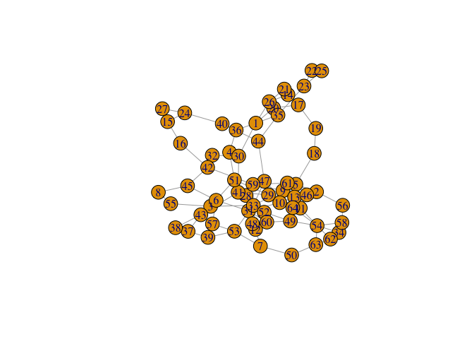
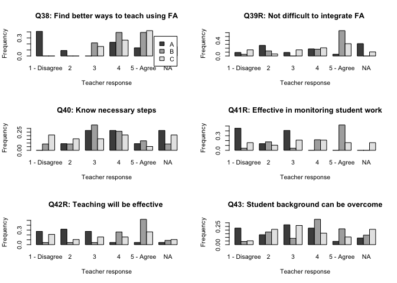
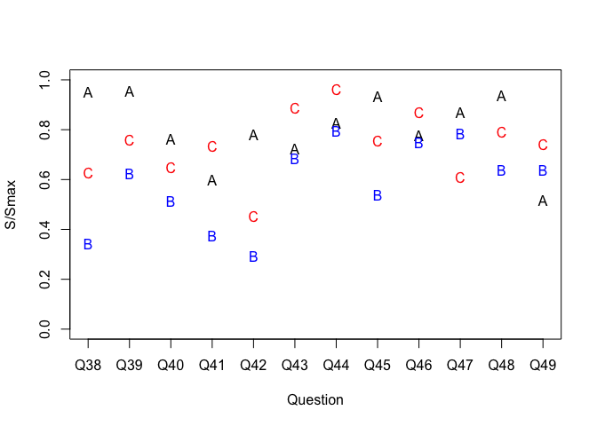

Similarity network analyses of self-efficacy attributes
================
Jesper Bruun
3/12/2020

## Description

``` r
library(igraph)
```

    ## 
    ## Attaching package: 'igraph'

    ## The following objects are masked from 'package:stats':
    ## 
    ##     decompose, spectrum

    ## The following object is masked from 'package:base':
    ## 
    ##     union

``` r
library(PMCMRplus)
library(pgirmess)
library(effsize)
#library(rcompanion)
library(gplots)
```

    ## 
    ## Attaching package: 'gplots'

    ## The following object is masked from 'package:stats':
    ## 
    ##     lowess

``` r
source("R_scripts/backboneExtraction.r")
source("R_scripts/segregation.r")
```

## Load data

## Make respondent similarity networks

    ##  [1] "pre38" "pre39" "pre40" "pre41" "pre42" "pre43" "pre44" "pre45" "pre46"
    ## [10] "pre47" "pre48" "pre49"

    ##  [1] "post38" "post39" "post40" "post41" "post42" "post43" "post44" "post45"
    ##  [9] "post46" "post47" "post48" "post49"

<!-- --><!-- -->

\#\#Infomap clustering

    ## [1] 0.9723268

    ## [1] 0.02760185

    ## [1] 0.9455897

    ## [1] 0.03625122

    ## [1] 0.4346165

## Find Optimal Super Group Solution

    ## [1] 0.4854486

    ## [1] 0.5151299

    ## [1] 0.5151299

## Describe optimal super group solution

    ## 
    ##  Wilcoxon rank sum test with continuity correction
    ## 
    ## data:  allInt and allExt
    ## W = 925, p-value = 0.02827
    ## alternative hypothesis: true location shift is not equal to 0

    ## 
    ##  Welch Two Sample t-test
    ## 
    ## data:  allInt and allExt
    ## t = 3.13, df = 28.9, p-value = 0.003974
    ## alternative hypothesis: true difference in means is not equal to 0
    ## 95 percent confidence interval:
    ##  0.01886764 0.09004173
    ## sample estimates:
    ## mean of x mean of y 
    ## 0.5076376 0.4531829

## Characterise Super Groups

<!-- --><!-- --><!-- --><!-- --><!-- --><!-- -->

## Kruskal-Wallis and Nemenyi tests

    ## Warning in kwAllPairsNemenyiTest.default(c(4L, 5L, 4L, 3L, 4L, 4L, 3L, 3L, :
    ## Ties are present. Chi-sq was corrected for ties.

    ## 
    ##  Pairwise comparisons using Nemenyi's all-pairs test with chi-square approximation

    ## data: newdata$post38 by supergroups

    ## alternative hypothesis: two.sided

    ## P value adjustment method: single-step

    ## H0

    ##            X^2 value Pr(>|X^2|)    
    ## B - A == 0    28.675  5.934e-07 ***
    ## C - A == 0     3.168  0.2051672    
    ## C - B == 0    12.459  0.0019704  **

    ## ---

    ## Signif. codes: 0 '***' 0.001 '**' 0.01 '*' 0.05 '.' 0.1 ' ' 1

    ## Warning in kwAllPairsNemenyiTest.default(c(4L, 4L, 4L, 4L, 1L, 5L, 2L, 3L, :
    ## Ties are present. Chi-sq was corrected for ties.

    ## 
    ##  Pairwise comparisons using Nemenyi's all-pairs test with chi-square approximation

    ## data: newdata$post39 by supergroups

    ## alternative hypothesis: two.sided

    ## P value adjustment method: single-step

    ## H0

    ##            X^2 value Pr(>|X^2|)   
    ## B - A == 0    12.267  0.0021687 **
    ## C - A == 0     4.642  0.0981582  .
    ## C - B == 0     1.436  0.4876923

    ## ---

    ## Signif. codes: 0 '***' 0.001 '**' 0.01 '*' 0.05 '.' 0.1 ' ' 1

    ## Warning in kwAllPairsNemenyiTest.default(c(3L, 4L, 3L, 3L, 4L, 3L, 4L, 2L, :
    ## Ties are present. Chi-sq was corrected for ties.

    ## 
    ##  Pairwise comparisons using Nemenyi's all-pairs test with chi-square approximation

    ## data: newdata$post40 by supergroups

    ## alternative hypothesis: two.sided

    ## P value adjustment method: single-step

    ## H0

    ##            X^2 value Pr(>|X^2|)    
    ## B - A == 0     2.809 0.24544889    
    ## C - A == 0     5.095 0.07826056   .
    ## C - B == 0    16.309 0.00028742 ***

    ## ---

    ## Signif. codes: 0 '***' 0.001 '**' 0.01 '*' 0.05 '.' 0.1 ' ' 1

    ## Warning in kwAllPairsNemenyiTest.default(c(3L, 4L, 3L, 2L, 4L, 4L, 5L, 5L, :
    ## Ties are present. Chi-sq was corrected for ties.

    ## 
    ##  Pairwise comparisons using Nemenyi's all-pairs test with chi-square approximation

    ## data: newdata$post41 by supergroups

    ## alternative hypothesis: two.sided

    ## P value adjustment method: single-step

    ## H0

    ##            X^2 value Pr(>|X^2|)    
    ## B - A == 0    29.502 3.9233e-07 ***
    ## C - A == 0     6.966   0.030719   *
    ## C - B == 0     4.919   0.085493   .

    ## ---

    ## Signif. codes: 0 '***' 0.001 '**' 0.01 '*' 0.05 '.' 0.1 ' ' 1

    ## Warning in kwAllPairsNemenyiTest.default(c(3L, 5L, 4L, 4L, 4L, 5L, 5L, 4L, :
    ## Ties are present. Chi-sq was corrected for ties.

    ## 
    ##  Pairwise comparisons using Nemenyi's all-pairs test with chi-square approximation

    ## data: newdata$post42 by supergroups

    ## alternative hypothesis: two.sided

    ## P value adjustment method: single-step

    ## H0

    ##            X^2 value Pr(>|X^2|)    
    ## B - A == 0    34.767 2.8217e-08 ***
    ## C - A == 0    25.632 2.7176e-06 ***
    ## C - B == 0     0.225    0.89352

    ## ---

    ## Signif. codes: 0 '***' 0.001 '**' 0.01 '*' 0.05 '.' 0.1 ' ' 1

    ## Warning in kwAllPairsNemenyiTest.default(c(3L, 5L, 1L, 3L, 3L, 4L, 2L, 3L, :
    ## Ties are present. Chi-sq was corrected for ties.

    ## 
    ##  Pairwise comparisons using Nemenyi's all-pairs test with chi-square approximation

    ## data: newdata$post43 by supergroups

    ## alternative hypothesis: two.sided

    ## P value adjustment method: single-step

    ## H0

    ##            X^2 value Pr(>|X^2|)    
    ## B - A == 0    23.031 9.9745e-06 ***
    ## C - A == 0     5.765   0.055989   .
    ## C - B == 0     4.204   0.122218

    ## ---

    ## Signif. codes: 0 '***' 0.001 '**' 0.01 '*' 0.05 '.' 0.1 ' ' 1

    ## Warning in kwAllPairsNemenyiTest.default(c(4L, 4L, 3L, 4L, 3L, 2L, 1L, 4L, :
    ## Ties are present. Chi-sq was corrected for ties.

    ## 
    ##  Pairwise comparisons using Nemenyi's all-pairs test with chi-square approximation

    ## data: newdata$post44 by supergroups

    ## alternative hypothesis: two.sided

    ## P value adjustment method: single-step

    ## H0

    ##            X^2 value Pr(>|X^2|)  
    ## B - A == 0     0.639   0.726426  
    ## C - A == 0     5.108   0.077760 .
    ## C - B == 0     8.811   0.012211 *

    ## ---

    ## Signif. codes: 0 '***' 0.001 '**' 0.01 '*' 0.05 '.' 0.1 ' ' 1

    ## Warning in kwAllPairsNemenyiTest.default(c(3L, 4L, 4L, 2L, 4L, 3L, 4L, 2L, :
    ## Ties are present. Chi-sq was corrected for ties.

    ## 
    ##  Pairwise comparisons using Nemenyi's all-pairs test with chi-square approximation

    ## data: newdata$post45 by supergroups

    ## alternative hypothesis: two.sided

    ## P value adjustment method: single-step

    ## H0

    ##            X^2 value Pr(>|X^2|)    
    ## B - A == 0    22.689 1.1835e-05 ***
    ## C - A == 0     1.272  0.5294416    
    ## C - B == 0    10.528  0.0051758  **

    ## ---

    ## Signif. codes: 0 '***' 0.001 '**' 0.01 '*' 0.05 '.' 0.1 ' ' 1

    ## Warning in kwAllPairsNemenyiTest.default(c(3L, 4L, 4L, 3L, 4L, 4L, 2L, 4L, :
    ## Ties are present. Chi-sq was corrected for ties.

    ## 
    ##  Pairwise comparisons using Nemenyi's all-pairs test with chi-square approximation

    ## data: newdata$post46 by supergroups

    ## alternative hypothesis: two.sided

    ## P value adjustment method: single-step

    ## H0

    ##            X^2 value Pr(>|X^2|)  
    ## B - A == 0     2.874   0.237662  
    ## C - A == 0     1.444   0.485741  
    ## C - B == 0     6.775   0.033791 *

    ## ---

    ## Signif. codes: 0 '***' 0.001 '**' 0.01 '*' 0.05 '.' 0.1 ' ' 1

    ## Warning in kwAllPairsNemenyiTest.default(c(3L, 4L, 5L, 5L, 4L, 5L, 5L, 2L, :
    ## Ties are present. Chi-sq was corrected for ties.

    ## 
    ##  Pairwise comparisons using Nemenyi's all-pairs test with chi-square approximation

    ## data: newdata$post47 by supergroups

    ## alternative hypothesis: two.sided

    ## P value adjustment method: single-step

    ## H0

    ##            X^2 value Pr(>|X^2|)  
    ## B - A == 0     4.180   0.123683  
    ## C - A == 0     5.501   0.063892 .
    ## C - B == 0     0.154   0.926003

    ## ---

    ## Signif. codes: 0 '***' 0.001 '**' 0.01 '*' 0.05 '.' 0.1 ' ' 1

    ## Warning in kwAllPairsNemenyiTest.default(c(3L, 4L, 5L, 3L, 4L, 4L, 5L, 3L, :
    ## Ties are present. Chi-sq was corrected for ties.

    ## 
    ##  Pairwise comparisons using Nemenyi's all-pairs test with chi-square approximation

    ## data: newdata$post48 by supergroups

    ## alternative hypothesis: two.sided

    ## P value adjustment method: single-step

    ## H0

    ##            X^2 value Pr(>|X^2|)   
    ## B - A == 0    13.046  0.0014693 **
    ## C - A == 0    10.983  0.0041214 **
    ## C - B == 0     0.000  0.9997512

    ## ---

    ## Signif. codes: 0 '***' 0.001 '**' 0.01 '*' 0.05 '.' 0.1 ' ' 1

    ## Warning in kwAllPairsNemenyiTest.default(c(2L, 3L, 4L, 3L, 3L, 3L, 4L, 3L, :
    ## Ties are present. Chi-sq was corrected for ties.

    ## 
    ##  Pairwise comparisons using Nemenyi's all-pairs test with chi-square approximation

    ## data: newdata$post49 by supergroups

    ## alternative hypothesis: two.sided

    ## P value adjustment method: single-step

    ## H0

    ##            X^2 value Pr(>|X^2|)    
    ## B - A == 0    28.343 7.0049e-07 ***
    ## C - A == 0     7.356   0.025278   *
    ## C - B == 0     5.465   0.065049   .

    ## ---

    ## Signif. codes: 0 '***' 0.001 '**' 0.01 '*' 0.05 '.' 0.1 ' ' 1

## Segregation analysis

    ## [1] 9.923631

    ## [1] 0.2229458

    ## [1] -0.05487449

    ## [1] -0.5544493

    ## [1] -0.5367687

    ## [1] 1.427654

    ## [1] 2.800479

    ## [1] 0.009618495

    ## [1] 1.153237

    ## [1] 3.047224

    ## [1] 15.80032

\#\#Entropy analysis
<!-- --><!-- -->
\#\#Single question analyses
