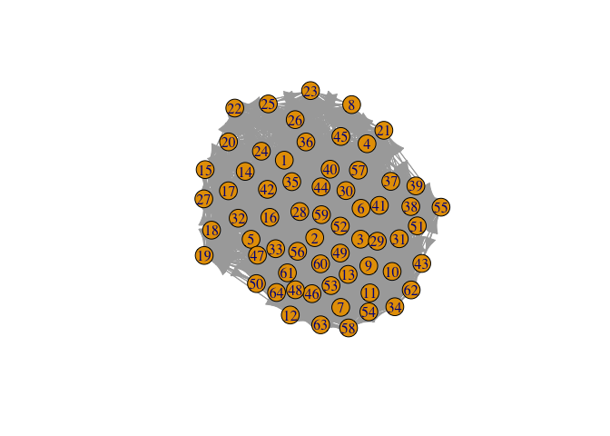
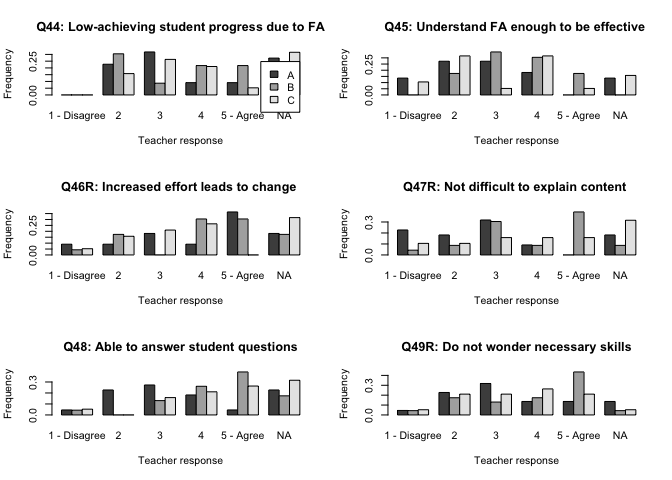
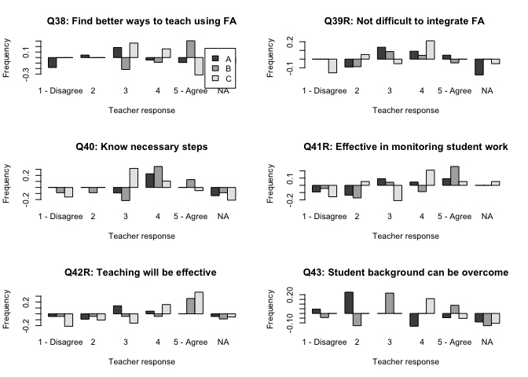

Similarity network analyses of self-efficacy attributes
================
Jesper Bruun
3/12/2020

## Description

``` r
library(igraph)
```

    ## 
    ## Attaching package: 'igraph'

    ## The following objects are masked from 'package:stats':
    ## 
    ##     decompose, spectrum

    ## The following object is masked from 'package:base':
    ## 
    ##     union

``` r
library(PMCMRplus)
library(pgirmess)
library(effsize)
#library(rcompanion)
library(gplots)
```

    ## 
    ## Attaching package: 'gplots'

    ## The following object is masked from 'package:stats':
    ## 
    ##     lowess

``` r
source("R_scripts/backboneExtraction.r")
source("R_scripts/segregation.r")
```

## Load data

## Make respondent similarity networks

    ##  [1] "pre38" "pre39" "pre40" "pre41" "pre42" "pre43" "pre44" "pre45" "pre46"
    ## [10] "pre47" "pre48" "pre49"

    ##  [1] "post38" "post39" "post40" "post41" "post42" "post43" "post44" "post45"
    ##  [9] "post46" "post47" "post48" "post49"

<!-- --><!-- -->

\#\#Infomap clustering

    ## [1] 0.9723268

    ## [1] 0.02760185

    ## [1] 0.9455897

    ## [1] 0.03625122

    ## [1] 0.4346165

## Find Optimal Super Group Solution

    ## [1] 0.4854486

    ## [1] 0.5151299

    ## [1] 0.5151299

## Characterise Super Groups

``` r
##CHARACTERISE SUPERGROUPS
newdata<-mydata[mydata$control=="n",]
#load supergroups
respT<-newdata[15:26]
respT[is.na(respT)]<-0
respTpre<-newdata[3:14]
respTpre[is.na(respTpre)]<-0
anMat<-function(data,memb,letter){
  sgax<-matrix(0,nrow=12,ncol=7)
  sgax[,1]<-c(38:49)
  N<-length(which(memb==letter))
  colnames(sgax)<-c("Q","1 - Disagree",2:4,"5 - Agree", "NA")
  sgax[1,2]<-length(which(respT[memb==letter,]$post38==1))/N
  sgax[1,3]<-length(which(respT[memb==letter,]$post38==2))/N
  sgax[1,4]<-length(which(respT[memb==letter,]$post38==3))/N
  sgax[1,5]<-length(which(respT[memb==letter,]$post38==4))/N
  sgax[1,6]<-length(which(respT[memb==letter,]$post38==5))/N
  sgax[1,7]<-length(which(respT[memb==letter,]$post38==0))/N
  
  sgax[2,2]<-length(which(respT[memb==letter,]$post39==1))/N
  sgax[2,3]<-length(which(respT[memb==letter,]$post39==2))/N
  sgax[2,4]<-length(which(respT[memb==letter,]$post39==3))/N
  sgax[2,5]<-length(which(respT[memb==letter,]$post39==4))/N
  sgax[2,6]<-length(which(respT[memb==letter,]$post39==5))/N
  sgax[2,7]<-length(which(respT[memb==letter,]$post39==0))/N
  
  sgax[3,2]<-length(which(respT[memb==letter,]$post40==1))/N
  sgax[3,3]<-length(which(respT[memb==letter,]$post40==2))/N
  sgax[3,4]<-length(which(respT[memb==letter,]$post40==3))/N
  sgax[3,5]<-length(which(respT[memb==letter,]$post40==4))/N
  sgax[3,6]<-length(which(respT[memb==letter,]$post40==5))/N
  sgax[3,7]<-length(which(respT[memb==letter,]$post40==0))/N
  
  sgax[4,2]<-length(which(respT[memb==letter,]$post41==1))/N
  sgax[4,3]<-length(which(respT[memb==letter,]$post41==2))/N
  sgax[4,4]<-length(which(respT[memb==letter,]$post41==3))/N
  sgax[4,5]<-length(which(respT[memb==letter,]$post41==4))/N
  sgax[4,6]<-length(which(respT[memb==letter,]$post41==5))/N
  sgax[4,7]<-length(which(respT[memb==letter,]$post41==0))/N
  
  sgax[5,2]<-length(which(respT[memb==letter,]$post42==1))/N
  sgax[5,3]<-length(which(respT[memb==letter,]$post42==2))/N
  sgax[5,4]<-length(which(respT[memb==letter,]$post42==3))/N
  sgax[5,5]<-length(which(respT[memb==letter,]$post42==4))/N
  sgax[5,6]<-length(which(respT[memb==letter,]$post42==5))/N
  sgax[5,7]<-length(which(respT[memb==letter,]$post42==0))/N
  
  sgax[6,2]<-length(which(respT[memb==letter,]$post43==1))/N
  sgax[6,3]<-length(which(respT[memb==letter,]$post43==2))/N
  sgax[6,4]<-length(which(respT[memb==letter,]$post43==3))/N
  sgax[6,5]<-length(which(respT[memb==letter,]$post43==4))/N
  sgax[6,6]<-length(which(respT[memb==letter,]$post43==5))/N
  sgax[6,7]<-length(which(respT[memb==letter,]$post43==0))/N
  
  sgax[7,2]<-length(which(respT[memb==letter,]$post44==1))/N
  sgax[7,3]<-length(which(respT[memb==letter,]$post44==2))/N
  sgax[7,4]<-length(which(respT[memb==letter,]$post44==3))/N
  sgax[7,5]<-length(which(respT[memb==letter,]$post44==4))/N
  sgax[7,6]<-length(which(respT[memb==letter,]$post44==5))/N
  sgax[7,7]<-length(which(respT[memb==letter,]$post44==0))/N
  
  sgax[8,2]<-length(which(respT[memb==letter,]$post45==1))/N
  sgax[8,3]<-length(which(respT[memb==letter,]$post45==2))/N
  sgax[8,4]<-length(which(respT[memb==letter,]$post45==3))/N
  sgax[8,5]<-length(which(respT[memb==letter,]$post45==4))/N
  sgax[8,6]<-length(which(respT[memb==letter,]$post45==5))/N
  sgax[8,7]<-length(which(respT[memb==letter,]$post45==0))/N
  
  sgax[9,2]<-length(which(respT[memb==letter,]$post46==1))/N
  sgax[9,3]<-length(which(respT[memb==letter,]$post46==2))/N
  sgax[9,4]<-length(which(respT[memb==letter,]$post46==3))/N
  sgax[9,5]<-length(which(respT[memb==letter,]$post46==4))/N
  sgax[9,6]<-length(which(respT[memb==letter,]$post46==5))/N
  sgax[9,7]<-length(which(respT[memb==letter,]$post46==0))/N
  
  sgax[10,2]<-length(which(respT[memb==letter,]$post47==1))/N
  sgax[10,3]<-length(which(respT[memb==letter,]$post47==2))/N
  sgax[10,4]<-length(which(respT[memb==letter,]$post47==3))/N
  sgax[10,5]<-length(which(respT[memb==letter,]$post47==4))/N
  sgax[10,6]<-length(which(respT[memb==letter,]$post47==5))/N
  sgax[10,7]<-length(which(respT[memb==letter,]$post47==0))/N
  
  sgax[11,2]<-length(which(respT[memb==letter,]$post48==1))/N
  sgax[11,3]<-length(which(respT[memb==letter,]$post48==2))/N
  sgax[11,4]<-length(which(respT[memb==letter,]$post48==3))/N
  sgax[11,5]<-length(which(respT[memb==letter,]$post48==4))/N
  sgax[11,6]<-length(which(respT[memb==letter,]$post48==5))/N
  sgax[11,7]<-length(which(respT[memb==letter,]$post48==0))/N
  
  sgax[12,2]<-length(which(respT[memb==letter,]$post49==1))/N
  sgax[12,3]<-length(which(respT[memb==letter,]$post49==2))/N
  sgax[12,4]<-length(which(respT[memb==letter,]$post49==3))/N
  sgax[12,5]<-length(which(respT[memb==letter,]$post49==4))/N
  sgax[12,6]<-length(which(respT[memb==letter,]$post49==5))/N
  sgax[12,7]<-length(which(respT[memb==letter,]$post49==0))/N
  return(sgax)
}

anMatPre<-function(data,memb,letter){
  sgax<-matrix(0,nrow=12,ncol=7)
  sgax[,1]<-c(38:49)
  N<-length(which(memb==letter))
  colnames(sgax)<-c("Q","1 - Disagree",2:4,"5 - Agree", "NA")
  sgax[1,2]<-length(which(data[memb==letter,]$pre38==1))/N
  sgax[1,3]<-length(which(data[memb==letter,]$pre38==2))/N
  sgax[1,4]<-length(which(data[memb==letter,]$pre38==3))/N
  sgax[1,5]<-length(which(data[memb==letter,]$pre38==4))/N
  sgax[1,6]<-length(which(data[memb==letter,]$pre38==5))/N
  sgax[1,7]<-length(which(data[memb==letter,]$pre38==0))/N
  
  sgax[2,2]<-length(which(data[memb==letter,]$pre39==1))/N
  sgax[2,3]<-length(which(data[memb==letter,]$pre39==2))/N
  sgax[2,4]<-length(which(data[memb==letter,]$pre39==3))/N
  sgax[2,5]<-length(which(data[memb==letter,]$pre39==4))/N
  sgax[2,6]<-length(which(data[memb==letter,]$pre39==5))/N
  sgax[2,7]<-length(which(data[memb==letter,]$pre39==0))/N
  
  sgax[3,2]<-length(which(data[memb==letter,]$pre40==1))/N
  sgax[3,3]<-length(which(data[memb==letter,]$pre40==2))/N
  sgax[3,4]<-length(which(data[memb==letter,]$pre40==3))/N
  sgax[3,5]<-length(which(data[memb==letter,]$pre40==4))/N
  sgax[3,6]<-length(which(data[memb==letter,]$pre40==5))/N
  sgax[3,7]<-length(which(data[memb==letter,]$pre40==0))/N
  
  sgax[4,2]<-length(which(data[memb==letter,]$pre41==1))/N
  sgax[4,3]<-length(which(data[memb==letter,]$pre41==2))/N
  sgax[4,4]<-length(which(data[memb==letter,]$pre41==3))/N
  sgax[4,5]<-length(which(data[memb==letter,]$pre41==4))/N
  sgax[4,6]<-length(which(data[memb==letter,]$pre41==5))/N
  sgax[4,7]<-length(which(data[memb==letter,]$pre41==0))/N
  
  sgax[5,2]<-length(which(data[memb==letter,]$pre42==1))/N
  sgax[5,3]<-length(which(data[memb==letter,]$pre42==2))/N
  sgax[5,4]<-length(which(data[memb==letter,]$pre42==3))/N
  sgax[5,5]<-length(which(data[memb==letter,]$pre42==4))/N
  sgax[5,6]<-length(which(data[memb==letter,]$pre42==5))/N
  sgax[5,7]<-length(which(data[memb==letter,]$pre42==0))/N
  
  sgax[6,2]<-length(which(data[memb==letter,]$pre43==1))/N
  sgax[6,3]<-length(which(data[memb==letter,]$pre43==2))/N
  sgax[6,4]<-length(which(data[memb==letter,]$pre43==3))/N
  sgax[6,5]<-length(which(data[memb==letter,]$pre43==4))/N
  sgax[6,6]<-length(which(data[memb==letter,]$pre43==5))/N
  sgax[6,7]<-length(which(data[memb==letter,]$pre43==0))/N
  
  sgax[7,2]<-length(which(data[memb==letter,]$pre44==1))/N
  sgax[7,3]<-length(which(data[memb==letter,]$pre44==2))/N
  sgax[7,4]<-length(which(data[memb==letter,]$pre44==3))/N
  sgax[7,5]<-length(which(data[memb==letter,]$pre44==4))/N
  sgax[7,6]<-length(which(data[memb==letter,]$pre44==5))/N
  sgax[7,7]<-length(which(data[memb==letter,]$pre44==0))/N
  
  sgax[8,2]<-length(which(data[memb==letter,]$pre45==1))/N
  sgax[8,3]<-length(which(data[memb==letter,]$pre45==2))/N
  sgax[8,4]<-length(which(data[memb==letter,]$pre45==3))/N
  sgax[8,5]<-length(which(data[memb==letter,]$pre45==4))/N
  sgax[8,6]<-length(which(data[memb==letter,]$pre45==5))/N
  sgax[8,7]<-length(which(data[memb==letter,]$pre45==0))/N
  
  sgax[9,2]<-length(which(data[memb==letter,]$pre46==1))/N
  sgax[9,3]<-length(which(data[memb==letter,]$pre46==2))/N
  sgax[9,4]<-length(which(data[memb==letter,]$pre46==3))/N
  sgax[9,5]<-length(which(data[memb==letter,]$pre46==4))/N
  sgax[9,6]<-length(which(data[memb==letter,]$pre46==5))/N
  sgax[9,7]<-length(which(data[memb==letter,]$pre46==0))/N
  
  sgax[10,2]<-length(which(data[memb==letter,]$pre47==1))/N
  sgax[10,3]<-length(which(data[memb==letter,]$pre47==2))/N
  sgax[10,4]<-length(which(data[memb==letter,]$pre47==3))/N
  sgax[10,5]<-length(which(data[memb==letter,]$pre47==4))/N
  sgax[10,6]<-length(which(data[memb==letter,]$pre47==5))/N
  sgax[10,7]<-length(which(data[memb==letter,]$pre47==0))/N
  
  sgax[11,2]<-length(which(data[memb==letter,]$pre48==1))/N
  sgax[11,3]<-length(which(data[memb==letter,]$pre48==2))/N
  sgax[11,4]<-length(which(data[memb==letter,]$pre48==3))/N
  sgax[11,5]<-length(which(data[memb==letter,]$pre48==4))/N
  sgax[11,6]<-length(which(data[memb==letter,]$pre48==5))/N
  sgax[11,7]<-length(which(data[memb==letter,]$pre48==0))/N
  
  sgax[12,2]<-length(which(data[memb==letter,]$pre49==1))/N
  sgax[12,3]<-length(which(data[memb==letter,]$pre49==2))/N
  sgax[12,4]<-length(which(data[memb==letter,]$pre49==3))/N
  sgax[12,5]<-length(which(data[memb==letter,]$pre49==4))/N
  sgax[12,6]<-length(which(data[memb==letter,]$pre49==5))/N
  sgax[12,7]<-length(which(data[memb==letter,]$pre49==0))/N
  return(sgax)
}

##############SUPERGROUP PRE POST ANSWERS AND DIFFERENCES#######################################
sgAPre<-anMatPre(respTpre,supergroups,"A")
sgAPost<-anMat(respT,supergroups,"A")
sgADiff<-sgAPost-sgAPre
sgBPre<-anMatPre(respTpre,supergroups,"B")
sgBPost<-anMat(respT,supergroups,"B")
sgBDiff<-sgBPost-sgBPre
sgCPre<-anMatPre(respTpre,supergroups,"C")
sgCPost<-anMat(respT,supergroups,"C")
sgCDiff<-sgCPost-sgCPre


par(mfrow=c(3,2))
barplot(rbind(sgAPost[1,2:7],sgBPost[1,2:7],sgCPost[1,2:7]),beside=T,main="Q38: Find better ways to teach using FA",xlab="Teacher response",ylab="Frequency",legend=c("A","B","C"))
barplot(rbind(sgAPost[2,2:7],sgBPost[2,2:7],sgCPost[2,2:7]),beside=T,main="Q39R: Not difficult to integrate FA ",xlab="Teacher response",ylab="Frequency")
barplot(rbind(sgAPost[3,2:7],sgBPost[3,2:7],sgCPost[3,2:7]),beside=T,main="Q40: Know necessary steps",xlab="Teacher response",ylab="Frequency")
barplot(rbind(sgAPost[4,2:7],sgBPost[4,2:7],sgCPost[4,2:7]),beside=T,main="Q41R: Effective in monitoring student work",xlab="Teacher response",ylab="Frequency")
barplot(rbind(sgAPost[5,2:7],sgBPost[5,2:7],sgCPost[5,2:7]),beside=T,main="Q42R: Teaching will be effective ",xlab="Teacher response",ylab="Frequency")
barplot(rbind(sgAPost[6,2:7],sgBPost[6,2:7],sgCPost[6,2:7]),beside=T,main="Q43: Student background can be overcome",xlab="Teacher response",ylab="Frequency")
```

<!-- -->

``` r
par(mfrow=c(3,2))
barplot(rbind(sgAPost[7,2:7],sgBPost[7,2:7],sgCPost[7,2:7]),beside=T,main="Q44: Low-achieving student progress due to FA",xlab="Teacher response",ylab="Frequency",legend=c("A","B","C"))
barplot(rbind(sgAPost[8,2:7],sgBPost[8,2:7],sgCPost[8,2:7]),beside=T,main="Q45: Understand FA enough to be effective ",xlab="Teacher response",ylab="Frequency")
barplot(rbind(sgAPost[9,2:7],sgBPost[9,2:7],sgCPost[9,2:7]),beside=T,main="Q46R: Increased effort leads to change ",xlab="Teacher response",ylab="Frequency")
barplot(rbind(sgAPost[10,2:7],sgBPost[10,2:7],sgCPost[10,2:7]),beside=T,main="Q47R: Not difficult to explain content ",xlab="Teacher response",ylab="Frequency")
barplot(rbind(sgAPost[11,2:7],sgBPost[11,2:7],sgCPost[11,2:7]),beside=T,main="Q48: Able to answer student questions",xlab="Teacher response",ylab="Frequency")
barplot(rbind(sgAPost[12,2:7],sgBPost[12,2:7],sgCPost[12,2:7]),beside=T,main="Q49R: Do not wonder necessary skills",xlab="Teacher response",ylab="Frequency")
```

<!-- -->

``` r
#PRE
par(mfrow=c(3,2))
barplot(rbind(sgAPre[1,2:7],sgBPre[1,2:7],sgCPre[1,2:7]),beside=T,main="Q38: Find better ways to teach using FA",xlab="Teacher response",ylab="Frequency",legend=c("A","B","C"))
barplot(rbind(sgAPre[2,2:7],sgBPre[2,2:7],sgCPre[2,2:7]),beside=T,main="Q39R: Not difficult to integrate FA ",xlab="Teacher response",ylab="Frequency")
barplot(rbind(sgAPre[3,2:7],sgBPre[3,2:7],sgCPre[3,2:7]),beside=T,main="Q40: Know necessary steps",xlab="Teacher response",ylab="Frequency")
barplot(rbind(sgAPre[4,2:7],sgBPre[4,2:7],sgCPre[4,2:7]),beside=T,main="Q41R: Effective in monitoring student work",xlab="Teacher response",ylab="Frequency")
barplot(rbind(sgAPre[5,2:7],sgBPre[5,2:7],sgCPre[5,2:7]),beside=T,main="Q42R: Teaching will be effective ",xlab="Teacher response",ylab="Frequency")
barplot(rbind(sgAPre[6,2:7],sgBPre[6,2:7],sgCPre[6,2:7]),beside=T,main="Q43: Student background can be overcome",xlab="Teacher response",ylab="Frequency")
```

<!-- -->

``` r
par(mfrow=c(3,2))
barplot(rbind(sgAPre[7,2:7],sgBPre[7,2:7],sgCPre[7,2:7]),beside=T,main="Q44: Low-achieving student progress due to FA",xlab="Teacher response",ylab="Frequency",legend=c("A","B","C"))
barplot(rbind(sgAPre[8,2:7],sgBPre[8,2:7],sgCPre[8,2:7]),beside=T,main="Q45: Understand FA enough to be effective ",xlab="Teacher response",ylab="Frequency")
barplot(rbind(sgAPre[9,2:7],sgBPre[9,2:7],sgCPre[9,2:7]),beside=T,main="Q46R: Increased effort leads to change ",xlab="Teacher response",ylab="Frequency")
barplot(rbind(sgAPre[10,2:7],sgBPre[10,2:7],sgCPre[10,2:7]),beside=T,main="Q47R: Not difficult to explain content ",xlab="Teacher response",ylab="Frequency")
barplot(rbind(sgAPre[11,2:7],sgBPre[11,2:7],sgCPre[11,2:7]),beside=T,main="Q48: Able to answer student questions",xlab="Teacher response",ylab="Frequency")
barplot(rbind(sgAPre[12,2:7],sgBPre[12,2:7],sgCPre[12,2:7]),beside=T,main="Q49R: Do not wonder necessary skills",xlab="Teacher response",ylab="Frequency")
```

<!-- -->

``` r
#Differences between post and pre. 
par(mfrow=c(3,2))
barplot(rbind(sgADiff[1,2:7],sgBDiff[1,2:7],sgCDiff[1,2:7]),beside=T,main="Q38: Find better ways to teach using FA",xlab="Teacher response",ylab="Frequency",legend=c("A","B","C"))
barplot(rbind(sgADiff[2,2:7],sgBDiff[2,2:7],sgCDiff[2,2:7]),beside=T,main="Q39R: Not difficult to integrate FA ",xlab="Teacher response",ylab="Frequency")
barplot(rbind(sgADiff[3,2:7],sgBDiff[3,2:7],sgCDiff[3,2:7]),beside=T,main="Q40: Know necessary steps",xlab="Teacher response",ylab="Frequency")
barplot(rbind(sgADiff[4,2:7],sgBDiff[4,2:7],sgCDiff[4,2:7]),beside=T,main="Q41R: Effective in monitoring student work",xlab="Teacher response",ylab="Frequency")
barplot(rbind(sgADiff[5,2:7],sgBDiff[5,2:7],sgCDiff[5,2:7]),beside=T,main="Q42R: Teaching will be effective ",xlab="Teacher response",ylab="Frequency")
barplot(rbind(sgADiff[6,2:7],sgBDiff[6,2:7],sgCDiff[6,2:7]),beside=T,main="Q43: Student background can be overcome",xlab="Teacher response",ylab="Frequency")
```

<!-- -->

``` r
par(mfrow=c(3,2))
barplot(rbind(sgADiff[7,2:7],sgBDiff[7,2:7],sgCDiff[7,2:7]),beside=T,main="Q44: Low-achieving student progress due to FA",xlab="Teacher response",ylab="Frequency",legend=c("A","B","C"))
barplot(rbind(sgADiff[8,2:7],sgBDiff[8,2:7],sgCDiff[8,2:7]),beside=T,main="Q45: Understand FA enough to be effective ",xlab="Teacher response",ylab="Frequency")
barplot(rbind(sgADiff[9,2:7],sgBDiff[9,2:7],sgCDiff[9,2:7]),beside=T,main="Q46R: Increased effort leads to change ",xlab="Teacher response",ylab="Frequency")
barplot(rbind(sgADiff[10,2:7],sgBDiff[10,2:7],sgCDiff[10,2:7]),beside=T,main="Q47R: Not difficult to explain content ",xlab="Teacher response",ylab="Frequency")
barplot(rbind(sgADiff[11,2:7],sgBDiff[11,2:7],sgCDiff[11,2:7]),beside=T,main="Q48: Able to answer student questions",xlab="Teacher response",ylab="Frequency")
barplot(rbind(sgADiff[12,2:7],sgBDiff[12,2:7],sgCDiff[12,2:7]),beside=T,main="Q49R: Do not wonder necessary skills",xlab="Teacher response",ylab="Frequency")
```

<!-- -->

``` r
###############
```
